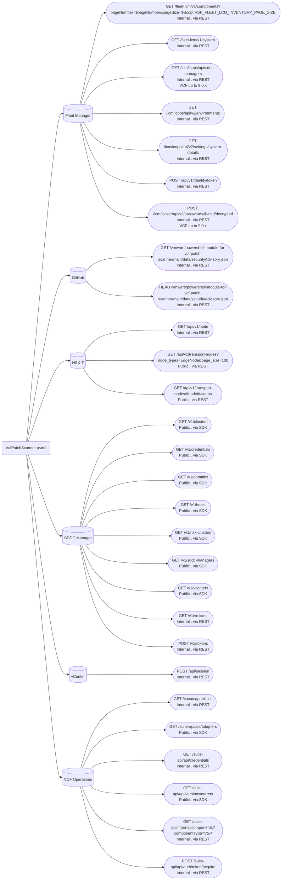
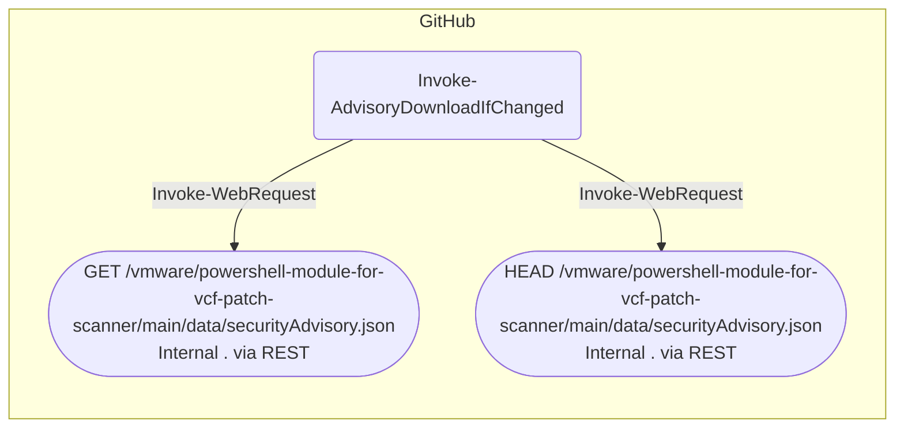
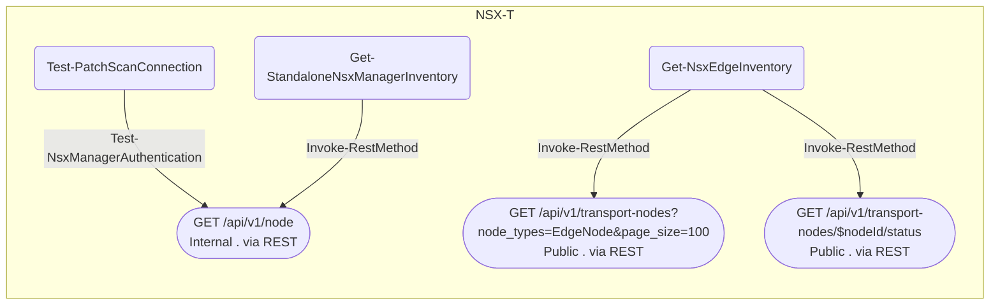
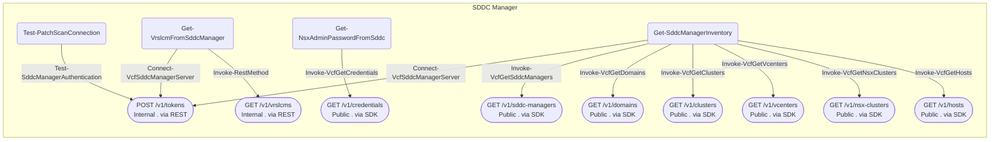
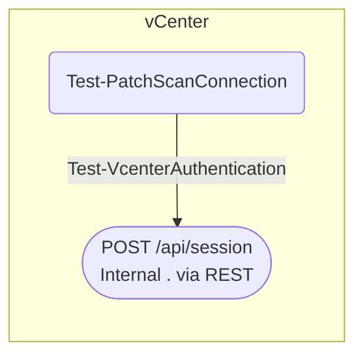

# API graph - VcfPatchScanner.psm1

Generated on **2026-06-24 12:28:25 -04:00**.

Sources analyzed:

- `VcfPatchScanner/VcfPatchScanner.psm1`

Auto-discovered via dot-source:

- `Private/Mapping.ps1`
- `Private/Logging.ps1`
- `Private/Settings.ps1`
- `Private/Advisory.ps1`
- `Private/Discovery.ps1`
- `Private/Inventory.ps1`
- `Private/Scanning.ps1`
- `Private/Findings.ps1`
- `Private/EntryPoint.ps1`
- `Private/Tools.ps1`
- `Tools/Invoke-VCFPatchScanner.ps1`

## Legend

- A node labeled `METHOD /path` is an HTTP endpoint. The second line of the label is `<Public|Internal> . <via SDK|via REST>`.
- A third label line (for example `VCF 9.0.x only`, `VCF 9.0–9.0.x`, `VCF 9.1+`) is rendered only when the API map declares the endpoint is *version-gated* (i.e. has a `MaxVcfVersion`). Endpoints that are simply available from the script's minimum VCF release upward skip the third line to keep the overview flowchart readable; their applicability is still surfaced in the **VCF release** column of the endpoints table below.
- SDK cmdlets are translated to their underlying HTTP endpoint; the specific cmdlet name appears on the edge into that endpoint, so two SDK cmdlets that call the same endpoint are both visible as separate edges.
- REST calls (project wrappers over `Invoke-RestMethod`) use the URL observed at the call site; the wrapper name appears on the edge.
- Local cmdlets (for example `Initialize-*` payload builders, client-side `Disconnect-*`) do not issue HTTP requests and are not rendered in the graph.

## Summary

| Metric | Count |
|---|---:|
| Call sites analyzed | 67 |
| Call sites mapped to an endpoint | 44 |
| Distinct endpoints | 28 |
| VCF-version-gated endpoints (max release set) | 2 |
| SDK cmdlet calls | 17 |
| REST calls | 27 |
| Public-endpoint calls | 19 |
| Internal-endpoint calls | 25 |
| Local (no HTTP) cmdlet calls | 23 |

### By target system

| Target system | Call sites | Distinct endpoints |
|---|---:|---:|
| Fleet Manager | 12 | 7 |
| GitHub | 2 | 2 |
| NSX-T | 4 | 3 |
| SDDC Manager | 11 | 9 |
| vCenter | 1 | 1 |
| VCF Operations | 14 | 6 |

## Overview

## Per target system

### Fleet Manager

```mermaid
flowchart TB
    subgraph FleetManagerSub ["Fleet Manager"]
      direction TB
      ep1(["GET /fleet-lcm/v1/components?pageNumber=$pageNumber&pageSize=$Script:VSP_FLEET_LCM_INVENTORY_PAGE_SIZE<br/>Internal . via REST"])
      ep2(["GET /fleet-lcm/v1/system<br/>Internal . via REST"])
      ep3(["GET /lcm/lcops/api/sddc-managers<br/>Internal . via REST<br/>VCF up to 9.0.x"])
      ep4(["GET /lcm/lcops/api/v2/environments<br/>Internal . via REST"])
      ep5(["GET /lcm/lcops/api/v2/settings/system-details<br/>Internal . via REST"])
      ep6(["POST /api/v1/identity/token<br/>Internal . via REST"])
      ep7(["POST /lcm/locker/api/v2/passwords/$vmid/decrypted<br/>Internal . via REST<br/>VCF up to 9.0.x"])
      fn1("Test-FleetManagerAuthentication") -->|"Get-VspBearerToken"| ep6
      fn1("Test-FleetManagerAuthentication") -->|"Invoke-RestMethod"| ep2
      fn1("Test-FleetManagerAuthentication") -->|"Invoke-RestMethod"| ep5
      fn2("Get-SddcCredentialFromFleetManager") -->|"Invoke-RestMethod"| ep3
      fn2("Get-SddcCredentialFromFleetManager") -->|"Invoke-RestMethod"| ep7
      fn3("Get-VspFleetLcmInventory") -->|"Get-VspBearerToken"| ep6
      fn3("Get-VspFleetLcmInventory") -->|"Invoke-RestMethod"| ep2
      fn3("Get-VspFleetLcmInventory") -->|"Invoke-RestMethod"| ep1
      fn4("Get-LcopsFleetManagerInventory") -->|"Invoke-RestMethod"| ep5
      fn4("Get-LcopsFleetManagerInventory") -->|"Invoke-RestMethod"| ep4
      fn5("Get-VrslcmInventory") -->|"Invoke-RestMethod"| ep5
      fn5("Get-VrslcmInventory") -->|"Invoke-RestMethod"| ep4
    end
```

### GitHub

### NSX-T

### SDDC Manager

### vCenter

### VCF Operations

```mermaid
flowchart TB
    subgraph VcfOperationsSub ["VCF Operations"]
      direction TB
      ep1(["GET /casa/capabilities<br/>Internal . via REST"])
      ep2(["GET /suite-api/api/adapters<br/>Public . via SDK"])
      ep3(["GET /suite-api/api/credentials<br/>Internal . via REST"])
      ep4(["GET /suite-api/api/versions/current<br/>Public . via SDK"])
      ep5(["GET /suite-api/internal/components?componentType=VSP<br/>Internal . via REST"])
      ep6(["POST /suite-api/api/auth/token/acquire<br/>Internal . via REST"])
      fn1("Test-VcfOpsAuthentication") -->|"Get-VcfOpsRestToken"| ep6
      fn2("Get-SddcManagerListFromVcfOps") -->|"Connect-VcfOpsServer"| ep6
      fn2("Get-SddcManagerListFromVcfOps") -->|"Invoke-VcfOpsEnumerateAdapterInstances"| ep2
      fn2("Get-SddcManagerListFromVcfOps") -->|"Get-VcfOpsRestToken"| ep6
      fn2("Get-SddcManagerListFromVcfOps") -->|"Invoke-RestMethod"| ep3
      fn2("Get-SddcManagerListFromVcfOps") -->|"Invoke-VcfOpsGetCurrentVersionOfServer"| ep4
      fn3("Get-VcfOpsVersion") -->|"Invoke-VcfOpsGetCurrentVersionOfServer"| ep4
      fn4("Get-FleetManagerFromVcfOps") -->|"Get-VcfOpsRestToken"| ep6
      fn4("Get-FleetManagerFromVcfOps") -->|"Invoke-RestMethod"| ep5
      fn4("Get-FleetManagerFromVcfOps") -->|"Invoke-RestMethod"| ep1
      fn5("Get-VcfOpsInventory") -->|"Connect-VcfOpsServer"| ep6
      fn5("Get-VcfOpsInventory") -->|"Invoke-VcfOpsGetCurrentVersionOfServer"| ep4
      fn5("Get-VcfOpsInventory") -->|"Invoke-VcfOpsEnumerateAdapterInstances"| ep2
    end
```

## Endpoints

| Target system | Method | Path | Visibility | Implementation | VCF release | Cmdlets | Call sites |
|---|---|---|---|---|---|---|---:|
| Fleet Manager | POST | `/api/v1/identity/token` | Internal | via REST | - | `Get-VspBearerToken` | 2 |
| Fleet Manager | GET | `/fleet-lcm/v1/components?pageNumber=$pageNumber&pageSize=$Script:VSP_FLEET_LCM_INVENTORY_PAGE_SIZE` | Internal | via REST | - | `Invoke-RestMethod` | 1 |
| Fleet Manager | GET | `/fleet-lcm/v1/system` | Internal | via REST | - | `Invoke-RestMethod` | 2 |
| Fleet Manager | GET | `/lcm/lcops/api/sddc-managers` | Internal | via REST | VCF up to 9.0.x | `Invoke-RestMethod` | 1 |
| Fleet Manager | GET | `/lcm/lcops/api/v2/environments` | Internal | via REST | - | `Invoke-RestMethod` | 2 |
| Fleet Manager | GET | `/lcm/lcops/api/v2/settings/system-details` | Internal | via REST | - | `Invoke-RestMethod` | 3 |
| Fleet Manager | POST | `/lcm/locker/api/v2/passwords/$vmid/decrypted` | Internal | via REST | VCF up to 9.0.x | `Invoke-RestMethod` | 1 |
| GitHub | GET | `/vmware/powershell-module-for-vcf-patch-scanner/main/data/securityAdvisory.json` | Internal | via REST | - | `Invoke-WebRequest` | 1 |
| GitHub | HEAD | `/vmware/powershell-module-for-vcf-patch-scanner/main/data/securityAdvisory.json` | Internal | via REST | - | `Invoke-WebRequest` | 1 |
| NSX-T | GET | `/api/v1/node` | Internal | via REST | - | `Test-NsxManagerAuthentication, Invoke-RestMethod` | 2 |
| NSX-T | GET | `/api/v1/transport-nodes?node_types=EdgeNode&page_size=100` | Public | via REST | - | `Invoke-RestMethod` | 1 |
| NSX-T | GET | `/api/v1/transport-nodes/$nodeId/status` | Public | via REST | - | `Invoke-RestMethod` | 1 |
| SDDC Manager | GET | `/v1/clusters` | Public | via SDK | VCF 9.0+ | `Invoke-VcfGetClusters` | 1 |
| SDDC Manager | GET | `/v1/credentials` | Public | via SDK | VCF 9.0+ | `Invoke-VcfGetCredentials` | 1 |
| SDDC Manager | GET | `/v1/domains` | Public | via SDK | VCF 9.0+ | `Invoke-VcfGetDomains` | 1 |
| SDDC Manager | GET | `/v1/hosts` | Public | via SDK | VCF 9.0+ | `Invoke-VcfGetHosts` | 1 |
| SDDC Manager | GET | `/v1/nsx-clusters` | Public | via SDK | VCF 9.0+ | `Invoke-VcfGetNsxClusters` | 1 |
| SDDC Manager | GET | `/v1/sddc-managers` | Public | via SDK | VCF 9.0+ | `Invoke-VcfGetSddcManagers` | 1 |
| SDDC Manager | POST | `/v1/tokens` | Internal | via REST | - | `Test-SddcManagerAuthentication, Connect-VcfSddcManagerServer` | 3 |
| SDDC Manager | GET | `/v1/vcenters` | Public | via SDK | VCF 9.0+ | `Invoke-VcfGetVcenters` | 1 |
| SDDC Manager | GET | `/v1/vrslcms` | Internal | via REST | - | `Invoke-RestMethod` | 1 |
| vCenter | POST | `/api/session` | Internal | via REST | - | `Test-VcenterAuthentication` | 1 |
| VCF Operations | GET | `/casa/capabilities` | Internal | via REST | - | `Invoke-RestMethod` | 1 |
| VCF Operations | GET | `/suite-api/api/adapters` | Public | via SDK | VCF 9.0+ | `Invoke-VcfOpsEnumerateAdapterInstances` | 3 |
| VCF Operations | POST | `/suite-api/api/auth/token/acquire` | Internal | via REST | - | `Get-VcfOpsRestToken, Connect-VcfOpsServer` | 5 |
| VCF Operations | GET | `/suite-api/api/credentials` | Internal | via REST | - | `Invoke-RestMethod` | 1 |
| VCF Operations | GET | `/suite-api/api/versions/current` | Public | via SDK | VCF 9.0+ | `Invoke-VcfOpsGetCurrentVersionOfServer` | 3 |
| VCF Operations | GET | `/suite-api/internal/components?componentType=VSP` | Internal | via REST | - | `Invoke-RestMethod` | 1 |

## VCF version applicability

The following endpoints are **version-gated** — the API map declares a `MaxVcfVersion`, meaning they are only delivered on specific VCF releases. The consuming script must check the live VCF release and skip these calls on later trains (for example, `Invoke-VCFPatchPlan.ps1` gates Fleet Manager on `Test-PatchPlanIsVcfOpsVersion9Dot0x` and skips it on VCF 9.1+).

| Target system | Method | Path | Visibility | VCF release | Cmdlets |
|---|---|---|---|---|---|
| Fleet Manager | GET | `/lcm/lcops/api/sddc-managers` | Internal | VCF up to 9.0.x | `Invoke-RestMethod` |
| Fleet Manager | POST | `/lcm/locker/api/v2/passwords/$vmid/decrypted` | Internal | VCF up to 9.0.x | `Invoke-RestMethod` |

